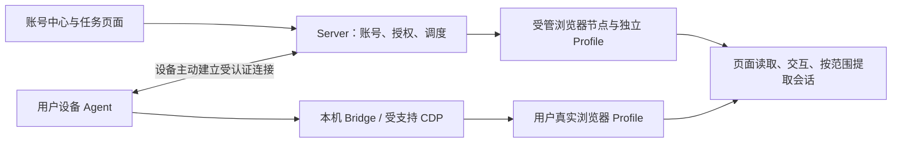

# 浏览器接入与多账号能力对齐

日期：2026-09-05。依据：本轮用户对功能范围的确认，以及本机 OpenCLIApp 安装文件与本项目源码的只读核对。

本文定义能力范围和验收标准，不表示以下缺口已经实现。验证码自动处理暂不纳入。分类和网站快捷入口不是接入白名单。

## 产品范围

统一管理用户设备上的真实浏览器、远程设备上的真实浏览器，以及平台创建的受管浏览器。服务器可以完全无头，由已接入设备提供浏览器执行能力。网页登录是获取会话的一种方式，接入已有浏览器及已有登录态同样是一等能力。

必须并行支持：

1. **原浏览器执行**：设备 Agent 连接本机 Browser Bridge/受支持 CDP，通过原 Profile 执行导航、读取和交互；会话可以留在原设备，不要求先导出 Cookie。
2. **会话提取与复用**：按选定网站、账号、Profile 提取 Cookie；在明确的账号会话范围中保存或供采集使用。对于依赖 Local Storage 等其他状态的网站，需明确报告可迁移范围，不能把 Cookie 导入成功当作登录成功。
3. **受管浏览器执行**：平台准备独立 Profile，用户在前端登录，任务使用该账号的浏览器。现有 Docker 登录能力保留，但不是账号的唯一来源。

网站可以是社媒、AI 服务或任意其他网站。通用浏览器操作与网站业务适配器分开：能够打开、读取一个网站，不等于已具备该网站全部业务操作。

## 对照基线与证据

本机基线目录：`C:\Users\Administrator\AppData\Local\OpenCLIApp`。

- `node_modules/@jackwener/opencli/package.json`：内置 OpenCLI **1.8.6**。
- 同目录 `README.zh-CN.md`：真实已登录浏览器、Browser Bridge + 本地 daemon、通用导航/DOM读取/交互、CDP、session/tab路由；说明 App 提供诊断、更新、命令修复、登录态保活和网页转 Markdown。
- `dist/src/browser/profile.js`：Profile context ID、别名、默认项、显式与偏好路由区分。
- `dist/src/commands/daemon.js`：多个 Profile 已连接但未选择、指定 Profile 已断线、扩展未连接是不同状态。

这轮核对的是安装包内核和随包文档，未逐项运行原生托盘 GUI，也没有证明它的每项功能在当前设备均正常。后续对照测试应固定这一本地版本，不能只依据产品名称声称“全部兼容”。

## 能力矩阵

| 能力 | 对照依据 | 本项目现状 | 对齐要求 |
| --- | --- | --- | --- |
| 任意网站访问 | 内置 README 的 Browser Use | 账号页已可输入网址 | 全路径使用网站标识，预设仅作快捷入口 |
| 真实浏览器接入 | Bridge + daemon | 已有扩展代码；账号页未接 | 接入用户选定的浏览器 Profile，不要求重建环境 |
| 多 Profile 选择 | 1.8.6 profile.js | 扩展协议注释仍标记同步自1.7.4，未见 contextId 路由字段 | 做协议能力协商和显式 Profile 路由验证，不能仅更新版本号 |
| session / tab 精确路由 | README、target resolver | 扩展已有 workspace/page target ID | 保留选定设备/Profile/target，不默认找第一张标签页 |
| Cookie 提取 | 扩展 cookies action | 按 domain/url 调用 chrome.cookies.getAll | 绑定授权设备/Profile/账号，保留完整 Cookie 属性 |
| Cookie 加密保存/同步 | 本项目 CookieCloud adapter | 已有加密 cookie_jar，但唯一键仅 domain+name | 增加会话归属及完整键，杜绝同站多号、不同 path Cookie 覆盖 |
| 非 Cookie 登录态 | CookieCloud 数据形状说明 | adapter 明确忽略 local_storage_data | 明确状态种类与可迁移性，优先保留原浏览器执行路径 |
| Server 调用远程设备 | 本项目反向 WS | collect、agent_task已有反向派发 | 接通浏览器发现、账号绑定、通用浏览器命令及交互画面 |
| 受管浏览器 | 本项目 Docker 登录 | 已能独立 Profile 登录、显示画面 | 和真实浏览器使用统一账号入口、不同执行驱动 |
| 账号用于任务 | BrowserBinding、BrowserSpace | site唯一绑定，登录账号又被通用池排除 | 新的账号授权路由；保留通用池防误用，不能简单取消隔离 |
| 前端交互与状态 | 现有账号页 | 画面驱动只识别本机受管 agent-N容器 | 用同一UI呈现远程/本机驱动；展示断线、未授权、页面失效 |
| 诊断/更新/保活/Markdown | App随包README | 分散在节点、扩展和采集能力，未完成GUI逐项验证 | 纳入兼容清单；保活不承诺绕过网站过期策略 |
| 验证码 | 用户明确延期 | 不以此次完成为目标 | 保留需人工处理、暂停与恢复状态；不开发自动解码 |

## 必须区分的实体

| 实体 | 含义与规则 |
| --- | --- |
| 设备 | 浏览器真正运行的位置；拥有稳定设备ID、在线状态和授权归属 |
| 浏览器 / Profile | 设备上的独立登录存储上下文；不能把不同设备上的 Default 当作同一个 Profile |
| 网站 | 域名/来源与必要的登录域关联；分类、中文名称可扩展 |
| 网站账号 | 某网站的身份记录，绑定具体 Profile 或会话引用；昵称只是展示，不作唯一身份 |
| 会话快照 | 可选提取的Cookie等状态，带来源、范围、版本与时间，和实时浏览器会话区分 |
| 任务 session / tab | 一次操作租约和页面目标；新开标签页不等于获得独立Cookie或第二个账号 |

通常，同一网站的两个账号需要不同 Profile/隔离存储，或者网站自身明确支持且可识别的多账号上下文。不能仅靠两个 session 名称或两个标签页声称实现多账号隔离。

Cookie 唯一性至少在授权会话范围内区分 domain、name、path，并保留 hostOnly、SameSite、secure、httpOnly、expiry，以及浏览器提供的 store/partition 信息。现有全局 domain+name 表不能作为多账号产品的最终数据模型。旧数据没有来源账号时不能猜测归属或自动分配。

## 用户流程

账号中心提供“连接已有浏览器”和“新建独立浏览器”两个入口。

- 连接已有浏览器：连接/配对设备 → 自动发现已接入的浏览器和 Profile → 用户选择网站或当前页面 → 识别并绑定账号。用户无需填写 daemon 地址、容器名或Cookie字段。
- 新建独立浏览器：选择网站/填写网址 → 系统准备 → 前端登录 → 保存账号。
- 已有真实浏览器账号默认支持在原设备执行；提取/同步会话是独立操作，显示目的地和网站范围。
- 网站分类是筛选视图。每个网站可以有多个账号；卡片显示来源设备、Profile、会话状态、上次检查时间、备注和任务占用情况。
- 用户只处理设备接入、账号选择、必要登录。系统处理发现、路由、状态更新和错误解释。无法可靠识别昵称时自动编号，允许登录后再改备注。

“删除账号记录”“断开设备”“关闭受管浏览器”“清除登录数据”是不同动作。删除一个导入的账号记录不能清除用户真实浏览器的历史、其他账号或整个 Profile。

## Server 与设备的职责

Server 存放账号元数据、授权、任务和必要的加密会话；设备负责本机浏览器发现与执行。部署在 Server 上不代表它能直接读取用户电脑的浏览器目录，需要设备接入通道。

设备授权应能撤销，命令绑定设备/Profile/网站范围。默认不向公共网络暴露用户浏览器 CDP 或本地 daemon。网页内容不是授权来源；不能让页面指令改变账号选择、提取其他网站会话或扩大设备权限。

显式指定账号优先；默认账号按工作区/网站配置。账号离线、Profile失联或会话失效时返回具体状态，不悄悄切到另一个已登录账号。原浏览器执行和Cookie复用不能无提示互相替代。

## 可验证的完成标准

1. 选取预设之外的网站，不加代码也能接入浏览器、打开并读取页面。
2. 同一设备两个真实 Profile 登录同一网站的不同账号，任务分别得到对应账号结果，Cookie不覆盖。
3. 两台设备都具有名为 Default 的 Profile，绑定和执行仍准确区分。
4. Server 本身没有桌面浏览器，仍能通过设备主动连接完成指定账号的页面读取。
5. 设备断网时任务显示“设备离线”，恢复后按原绑定恢复；不借用别的账号。
6. 同一网站两个账号同步同名Cookie、同一账号保存不同path/partition Cookie，数据完整保留。
7. 源浏览器继续保持登录；取消授权、删除账号记录不会清除用户整个浏览器数据。
8. 用户明确选定账号后，工作流可使用它；未授权任务仍不能从普通池拿到该Profile。
9. 原设备执行、会话复用、受管浏览器三条路径分别测试；不会以其中一条成功代替其余能力验收。
10. 设备/daemon/扩展版本不兼容时显示明确诊断；GUI文档声称的功能需要另有实际运行证据。

## 本项目证据入口

- [浏览器扩展协议](../../chrome/extension-src/src/protocol.ts)
- [Cookie/截图/页面操作实现](../../chrome/extension-src/src/background.ts)
- [浏览器及单网站绑定模型](../../backend/models/browser.py)
- [现有Cookie存储模型](../../backend/models/cookie_jar.py)
- [CookieCloud同步](../../backend/auth/cookiecloud_sync.py)
- [远程设备反向通道](../../backend/ws_agent_manager.py)
- [设备注册与接入](../../backend/api/v1/nodes.py)
- [工作区浏览器空间](../../backend/models/browser_space.py)
- [受管账号页与隔离限制](../usage/browser-accounts.md)

本轮完成的是可追溯的功能对齐和缺口核对；尚未把上述三种接入路径全部接到账号中心。本轮未读取或上传用户真实Cookie。
