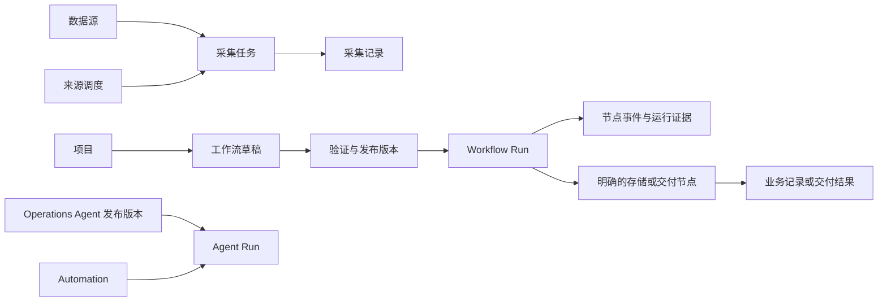

# OpenCLI 当前源码使用说明（核对稿）

核对日期：2026-09-05。源码基线：`ae02a27ddd8fd1855d298e8ac023fcb66b21b857`。

本文面向操作人员、外部 Agent 的接入开发者和部署管理员。它从当前实现反向整理使用路径，作为整套产品说明的第一版。尚未走通的步骤会明确停下来，不把设计约定写成已交付能力。

**当前结论：可以描述并验证“项目 → 工作流草稿 → 验证 → 发布 → 单次运行 → 运行追踪”的局部路径；还不能提供一条统一、经实际验收的“描述目标 → 持续采集 → 持久化数据 → 消费数据 → 调整并恢复”的完整路径。**

证据、矛盾和验收缺口见[产品契约核对记录](product-contract-findings.md)。产品术语以 [CONTEXT.md](../../CONTEXT.md) 为设计依据；它描述的部分能力尚未接入当前流程。安装与版本边界见 [README](../../README.md)。

## 1. 这个工具负责什么

OpenCLI 的产品目标是把数据采集、处理、复核和交付组织成持续运行的工作。人负责确定目标、检查结果和处理需要判断的事项；Agent 可以帮助配置、执行或分析；平台负责保存工作定义、运行状态和相应的结果。

当前有三条需要分别说明的操作路径。它们使用部分共同的采集能力，但运行对象和调度方式还没有完全统一。

| 路径 | 用户配置的对象 | 每次执行留下什么 | 重复执行的现有入口 |
| --- | --- | --- | --- |
| 来源采集 | 数据源及其采集、处理配置 | 采集任务及记录 | 数据源调度 `/schedules` |
| 项目工作流 | 项目中的草稿及发布版本 | Workflow Run、节点事件、投影；结果保存取决于节点 | 已发布版本的手动/API 调用；内置的固定版本周期调度未形成完整路径 |
| Operations Agent | Agent 定义、发布版本、运行绑定 | Operations Agent Run | Automation，目标是 Operations Agent |



上图表示本次查到的主路径，不表示这些运行记录已经完全互通。不能用“某个采集任务已完成”推断项目工作流成功，也不能用“Agent 定时执行已启用”推断某个工作流版本已按周期运行。

## 2. 开始前需要分清的几个对象

| 对象 | 使用时如何理解 | 需要保留的上下文 |
| --- | --- | --- |
| 工作区 | 成员、权限和共享配置的范围 | `workspace_id` |
| 项目 | 一项持续的数据目标及相关工作流的容器 | `project_id` |
| 工作流草稿 | 当前可编辑的节点和参数 | `workflow_id`、草稿 `revision` |
| 工作流版本 | 验证后发布的图快照 | 版本 ID/编号；后续改草稿不修改已有快照 |
| 运行 | 一次具体执行 | `run_id`、所用版本、`trace_id` |
| 业务记录 | 明确保存下来的采集或处理结果 | 记录 ID、来源和可用的运行血缘 |
| 运行证据 | 节点事件、错误、输出样本、投影、证据批次等 | 所属运行、节点和证据标识 |

“Agent”在现有界面中有不同含义：顶部助手用于交互；Operations Agent 有独立的定义和运行生命周期；外部 Codex/Claude 等客户端通过 API/MCP 接入；执行资源中的 Agent/Worker 负责实际运行。配置了一个模型，不代表这些角色都已就绪。

“持久化”也需要逐项核实：保存工作定义、保存运行记录、保存完整业务数据、重启后恢复执行，是四种不同承诺。当前实现前两项的证据最明确；后两项依赖具体路径和节点。

## 3. 安装、登录与就绪检查

按 [README 的安装版本边界](../../README.md#安装版本边界) 部署相应版本。当前源码与公开的 `v0.4.1` 安装行为有区别，应使用与源码提交或发布版本对应的说明。

| 地址 | 默认用途 | 如何核对 |
| --- | --- | --- |
| 前端 Compose 默认 `http://localhost:3010` | 操作界面 | 实际端口受 `FRONTEND_PORT` 和部署映射影响 |
| 后端默认 `http://localhost:8031` | API、健康检查、OpenAPI、内置 MCP | `/health`、`/openapi.json`、`/docs`、`/mcp` |
| 内置浏览器默认 `http://localhost:6080` | 登录需要账号的采集网站 | 实际端口受部署映射影响 |

本次现场使用的是本地开发前端 `8030`，代理到 `8031`。另一个 Docker 前端映射到 `3000`。这些是现场配置，不是新的产品默认值。API 镜像标签与 OpenAPI 显示 `0.4.1`，仅凭标签无法确认它与本次源码基线完全一致。

1. 检查后端 `/health`，再检查前端同源 `/health`。页面能打开只证明页面可访问。
2. 使用部署时建立的管理员账号登录。当前源码的密码初始化规则见 README；不要把 API 令牌当作界面密码。
3. 在“模型与连接”配置实际需要的模型，在“插件中心”核对需要的能力。
4. 对需要网站账号的采集，在对应浏览器环境完成登录；公开来源按其自身要求配置。
5. 在“执行资源”确认实际执行资源可用，并进行目标能力的检查。健康检查、插件已安装、工作流验证成功，都不能单独证明目标网站采集和交付可用。

本次已验证两个健康入口返回相同实例标识；没有执行生产采集、模型调用或外部发送。

## 4. 人如何创建和运行一个项目

### 创建并保存工作

1. 进入“项目”，选择实际工作区。
2. 点击“创建”，菜单提供“创建空白工作流”“描述需求创建”“从模板创建”“导入 DSL”。
3. 填写项目名称并创建。空白创建调用事务性 bootstrap，同时保存项目、主工作流和第一份草稿。
4. 在业务编排画布配置来源、处理及结果去向。模板或导入后的节点仍需要检查能力与运行条件；导入成功不代表执行兼容。
5. 点击“保存”或按 Ctrl/Cmd+S，查看“已保存”与草稿修订。项目画布的按钮、快捷键、命令面板和自动保存使用同一个项目草稿；独立画布仍保存到本地。草稿出现冲突时，需要重新读取当前修订并处理差异；不要反复覆盖旧修订。

“描述需求创建”会进入 `/studio/new`，生成并保存持久化项目草稿。顶部 Agent 也已接通受治理的项目创建和草稿修改：先生成提案，确认成功后返回真实草稿链接。两种入口共享项目 bootstrap 与草稿修订规则；查看保存状态后再进入验证与发布。会话恢复、通知和结果的衔接参见[从目标创建项目并继续处理结果](agent-project-workflow.md)。

### 验证、发布、运行

1. 在画布上方的常驻操作区查看保存状态、“验证”和“发布”，无需展开隐藏面板。未通过当前草稿验证时，发布按钮不可用。
2. 验证当前草稿。验证记录会保存当前修订及编译结果。检查活动节点、未接入节点和错误；未接入节点可能仅产生警告，因此应确认想执行的节点确实在执行图中。
3. 验证通过后发布。发布要求验证对应当前修订；修改后需要重新验证。
4. 点击“运行”打开输入面板，检查本次参数后点击“启动运行”；仅打开或重新打开面板不会提交任务。项目 API 执行入口读取当前发布版本并把实际版本写入本次运行；文件输入等特殊执行入口的版本边界另行核对。
5. 进入“运行记录”，核对本次运行、版本、状态和 Trace。请求返回 `202` 表示已接受，最终是否完成要继续读取运行状态和结果。

这些生命周期行为有本次通过的后端测试支撑。完整浏览器创建、真实采集、发布和运行未在本次现场重演。

### 查看数据并调整工作

1. 先从具体运行查看节点事件、错误和输出，保留 `run_id`。
2. 再查看数据和证据。同一项目与工作流内的标签保留运行上下文，可从提示条返回原运行；换项目或工作流不继承旧运行。当前某些项目页仍明确提示“项目级视图，未按 Run 筛选”，因此保留跳转上下文不等于数据已按该运行过滤。
3. 检查工作流是否包含真正写入业务记录的存储节点。运行事件或输出样本已经持久化，不代表全部采集内容都进入“成果与数据”。
4. 修改草稿，重新验证并发布。已有版本和历史运行应保留原来的定义；下一次调用使用哪个版本要从返回记录确认。

### 让它持续采集：当前需要停下来的地方

当前 `/schedules` 配置的是数据源采集；Automation 绑定的是 Operations Agent。源码核对没有找到把项目中的某个已发布工作流版本持久绑定到周期调度的完整实现。

因此现在不能写出“在项目中设定每小时运行这个版本，然后关闭页面即可持续采集”的已验证教程。外部调度器可以作为后续评估方案，但它需要明确版本选择、去重、重试、失败恢复和停止方式，不能在说明书中省略这些职责。

## 5. 外部 Agent 与开发者如何接入

### 选择入口与身份

后端 `/` 提供 API 发现信息；`/openapi.json` 是部署实例的请求结构依据。内置 Streamable HTTP MCP 地址是后端或前端代理的 `/mcp`。安装源码环境还可使用 `opencli-mcp` 启动 stdio 服务；它通过 `OPENCLI_ADMIN_API_URL` 访问后端，默认值为 `http://localhost:8031`。

API/Fleet 传输令牌、界面登录身份和工作区权限需要分别理解。MCP 包装器目前使用服务配置的 `API_AUTH_TOKEN` 请求 REST。工作区治理接口另外执行身份和权限检查。不要把请求里的 `user` 或工作区 ID 当作已经验证的用户权限。

接入时读取部署方给出的认证方式。OIDC 身份与 Fleet 令牌同时使用时，现有测试覆盖了 `Authorization` 放身份令牌、`X-API-Token` 放传输令牌的组合。凭证通过客户端受保护的配置传入，不写进工作流节点或可提交文件。

### 从已有发布工作流开始

项目的“API / MCP”页提供本项目地址和调用示例。以下展示现有 REST 合同，`B` 表示：

```text
/api/v1/workspaces/{workspace_id}/projects/{project_id}/workflows/{workflow_id}
```

| 动作 | 请求 | 必须检查的结果 |
| --- | --- | --- |
| 查看草稿 | `GET B/draft` | 草稿、当前修订 |
| 保存草稿 | `PUT B/draft`，body 含 `graph` 和当前 `revision` | 保存后的新修订；冲突不能当成功 |
| 验证草稿 | `POST B/draft/validation-runs`，body `{}` | `data.valid`、错误、`data.runId` |
| 发布 | `POST B/versions` | 版本 ID、编号、图快照 |
| 执行当前发布版本 | `POST B/runs` | `202`、`data.runId`；后续读取最终状态 |
| 查询状态与证据 | `GET B/runs/{run_id}`、`/trace`、`/events`、`/projection` | 同一次运行的状态、事件、投影 |

发布请求形状：

```json
{
  "reason": "确认当前采集方案",
  "expectedRevision": 1,
  "validationRunId": "<本次当前修订验证返回的 runId>"
}
```

`expectedRevision` 必须替换为实际当前修订，不能固定填 `1`。运行请求形状：

```json
{
  "inputs": {"topic": "<工作流实际声明的输入>"},
  "response_mode": "async",
  "user": "collection-client"
}
```

提供稳定的 `Idempotency-Key` 区分同一请求的重试和新一次采集；`inputs` 应与实际工作流期望的输入一致，并通过后续节点行为核对。上面的 JSON 是合同示例，不是对任意模板都可运行的采集配置。

MCP 的 `list_project_workflows`、`run_published_workflow`、`get_project_runtime_summary`、`list_project_runtime_logs`、`get_project_runtime_trace` 包装这些现有项目接口。本次 MCP 检查验证了协议工具发现和 REST 映射，没有证明所有外部客户端的生产接入。

### 从零创建：当前要跨越的边界

能力发现、`/api/v1/workflows/demand-draft`、`/patch` 和 `/compile` 可以构造、预览和编译图；它们不会替调用者保存项目或发布版本。

持久化项目使用 Studio bootstrap：`POST /api/v1/workspaces/{workspace_id}/projects/bootstrap`。工作区治理另有 `/api/v1/governance/workspaces/{workspace_id}/projects/bootstrap`，具有不同的身份校验路径。应按实际部署、身份和工作区映射核对入口，不能把两者任意互换。

当前 MCP 工具集没有覆盖项目 bootstrap、保存草稿、持久化验证和发布的完整链路。要完成这些步骤，接入方需要额外调用 REST 或由人操作。现阶段不能声称“配置一个 MCP 服务后，Agent 就能仅靠该工具集完成从需求到持久化持续采集”。

### 消费数据

现有 REST 记录查询入口为 `/api/v1/records`，可按来源、任务、项目等条件过滤；具体字段以部署的 OpenAPI 为准。MCP 的 `list_records` 提供来源/任务/状态/搜索/分页过滤，但没有与 REST 完全相同的项目过滤参数。项目运行的事件和投影使用上面的运行范围接口。

`Data Feed`、独立订阅以及按新鲜度自动补采是 [CONTEXT.md](../../CONTEXT.md) 中更完整的数据产品目标。本次没有证明它们已经组成统一、可复用的发布和消费流程；不把读取若干记录称为该目标已经交付。

## 6. 交付、失败与恢复

| 现象或目标 | 当前应怎么判断 |
| --- | --- |
| 验证通过 | 图可编译的证据；仍需核对实际账号、资源、权限及目的地 |
| 运行完成 | 核对具体节点输出、记录写入和外部回执，不能只看状态徽标 |
| 输出里有通知信息 | 检查节点绑定；`workflow.notify.send` 的投影信息本身不能证明已发送 |
| Webhook 交付 | runtime 有真实发送路径；测试使用模拟接收方，本次未向外部发送 |
| 受治理的接收方交付 | 有交付授权和执行接口，但未证明普通工作流完成后会自动接通它们 |
| 运行中服务重启 | 不同运行类型恢复规则不同；保存运行记录不保证自动续跑 |
| 某条路径支持恢复 | 区分等待外部输出、专用任务恢复、交付状态核对；不推导为所有工作流均可一键重试 |
| 接口错误 | 区分认证失败、无权限、请求字段错误、修订冲突和实际执行失败；保留请求及运行标识 |

具体恢复行为和卷保存要求见 [README 的恢复说明](../../README.md#restart-recovery-and-support)。管理员应保留数据库与浏览器 Profile 的持久卷。删除项目会连带删除其工作流、草稿、版本和运行记录，不能作为故障恢复步骤。

## 7. 其他页面与主流程的关系

| 当前入口 | 用途与边界 |
| --- | --- |
| 概览 | 全局态势；需要核对指标来源，不能把全局采集任务统计直接当成当前项目运行统计 |
| 任务与通知 | 待处理事项、采集任务和通知相关入口；与项目 Workflow Run 的对象关系尚需说明 |
| 项目 | 项目创建、工作流及项目内运行/数据视图 |
| 插件中心 | 安装和发现能力；安装状态与可执行状态需分别检查 |
| 自动化与智能体 | Operations Agent 与自动化；来源调度也归入该导航范围 |
| 成果与数据 | 已写入的业务记录；不包含所有运行中间值的保证 |
| 执行资源 | 执行节点和浏览器等环境；登记、在线、具备所需能力需要分别核对 |
| 模型与连接 | 模型提供方和连接配置 |
| 控制与安全 | 熔断、控制动作和审计；各业务路径的权限接线仍需按接口核对 |
| 系统与运维 | 系统配置、维护与诊断 |

可选运行时和专项能力按各自运行手册核对，例如 [Browser Spaces](../browser-spaces.md)、[QuestDB 分析运行时](../operations/questdb-analysis-runtime.md)、[Dify 兼容运行时](../acceptance/dify-p0-runbook.md)。本说明不将专项能力的存在推导为主流程已完整集成。

## 8. 把本稿变成正式说明书的验收条件

使用一个明确授权的测试项目，要求新操作人员或外部 Agent 不依赖开发者口头补充，完成以下同一条路径：

1. 按指定版本部署、登录，确认所需采集和执行能力。
2. 创建命名项目并保存工作流；重新进入后恢复同一对象。
3. 验证、发布并运行；能定位实际版本和本次执行。
4. 检查完整业务记录与来源证据；切换视图仍保留项目、运行和筛选范围。
5. 配置重复执行，至少观察两次执行；明确采用哪个版本。
6. 通过指定消费者取得数据，区分提交成功与对方确实接收。
7. 修改采集方案，保留旧版历史，明确后续执行何时采用新版。
8. 演练一次执行失败或服务重启，能解释中断、重复、恢复及停止的结果。

本次完成源码、现场只读观察和局部测试核对。以上完整验收尚未通过；其中持续执行、Agent 持久化闭环和结果/交付一致性已有明确缺口，见[核对记录](product-contract-findings.md)。
